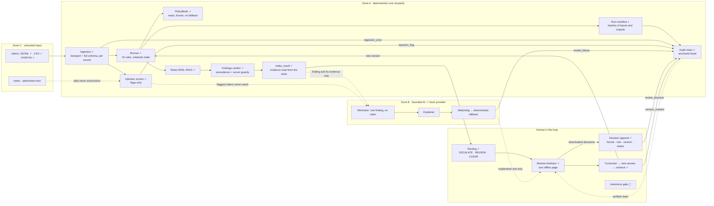

# ClaimGuard AI · architecture and data flow

Phase 1 deliverable. ✓ built and tested · ◻ planned.

## Trust boundaries

**The one-way rule.** Zone B writes explanation text only, to its own file. It cannot write a status, a severity or evidence: those come only from Zone A, and the scored results file is never written by the AI. A model answer is replaced by the rule's own explanation, and logged as `model_failure`, when it:
- fails validation;
- contradicts the finding;
- cites another rule, or evidence that does not exist;
- times out or errors.

**Untrusted text.** No rule reads `notes` or attachment `text`. R010 matches documents on type, patient, service and date only. The minimizer withholds free text and the claim ID from the model, and a claim the injection screen flags never reaches the model at all; it still gets all 15 results. Results quote claim values only as evidence, as the pack's result contract requires. The logs never quote claim text: an ingestion error, injection flag, rule error or model failure carries fixed text, field names and exception types only. The review interface inserts every string as text, never as HTML, and embeds the run's data with `<`, `>` and `&` escaped, so claim text cannot run in the page.

## Data flow

1. **Ingest.** Each record is checked on its own against the transport contract and the full claim schema.
   - Only `YYYY-MM-DD` dates are accepted.
   - NaN, Infinity, duplicate keys and non-object records are rejected.
   - A bad record becomes an `ingestion_error` with its line, stage and provenance, and every other record is still read.
   - Accepted claims carry provenance: adapter, file SHA-256, record SHA-256, line.
2. **Resolve policy.** Exact and case-sensitive. An unknown `policy_id` is `None`, and rules report UNABLE_TO_ASSESS, never FAIL.
3. **Run the rules.** All 15 run in rulebook order, each seeing a read-only copy of the results before it. A rule exception becomes UNABLE_TO_ASSESS with human review, and its exception type is recorded; `--strict` re-raises.
4. **Build results.** `make_result` resolves every evidence pointer against the original claim, so evidence cannot be fabricated. Deterministic results carry `confidence: null`.
5. **Screen.** Every string, decoded and normalized, is scanned for instruction-like text, including phrases split across fields. The check is linear in the number of fields. A flag never changes a result.
6. **Explain** (optional). Each FAIL and UNABLE_TO_ASSESS finding is minimized and sent to the provider. Every answer passes the watchdog or falls back.
7. **Route.**
   - Any high-severity FAIL or UNABLE_TO_ASSESS → ESCALATE.
   - Only medium- or low-severity ones → REVIEW.
   - All PASS or NOT_APPLICABLE → CLEAR: a clean pre-check, not approval.
8. **Record the run.**
   - The run manifest is written beside the results, with the SHA-256 of the input, of each accepted record, and of the results and explanations files.
   - The run's events (start, ingestion errors, injection flags, model failures, and a finish event carrying the manifest's hash) are appended to the hash chain in one batch, and the head is anchored.
   - A results or explanations file changed after the run therefore no longer matches the chain.
9. **Review.** `python -m claimguard.ui` builds one offline HTML page from the run's results, manifest, explanations and verified audit chain.
   - A reviewer decides each finding with a reason. Decisions stay in that browser until they are downloaded.
   - `python -m claimguard.ui.decisions` checks every decision against the run's claims and results, which it requires: event format, the actor's role (`claimguard.guards.rbac`), the date, that it was taken on this version of the claim, and on a finding at its current status.
   - It then appends all of them as `review_decision` events, or none.
10. **Correct.** `python -m claimguard.review.correct` applies a JSON Patch, creating a new immutable version linked to its parent by hash.
    - Each correction builds on the latest stored version: version 2, then 3, and so on. The stored versions are replayed from the claim as received first, and one that is not exactly its parent plus its recorded changes refuses the correction.
    - All 15 rules re-run on it, and the status changes are reported.
    - A rule that crashes is listed in the version's `rule_errors`, and the command exits with 2.
    - A `version_created` event records the version, and the page shows it after a rebuild.

## Tool permissions

| Component | Reads | Writes | Never |
|---|---|---|---|
| Ingestion | input files | ingestion errors | repairs or trims data |
| Rules | one claim, its policy, the service catalogue, earlier results (read-only) | a verdict | read the clock, labels, notes or attachment text |
| Runner | config, policies, accepted claims | the results file | change a rule's status |
| Injection screen | every string of a claim | flags | change a claim or a result |
| AI explainer | one minimized finding and its rule | an explanations file | write a status; see the claim, its ID or its free text |
| Routing | results, review events | routing rows | change a finding |
| Review interface | one run's outputs, embedded when the page is built | decision drafts in the browser, a downloaded decisions file | load or send anything over the network; write the audit log; run claim text |
| Decision append | downloaded decisions, claims, results, a role directory | `review_decision` events | append any decision of a file in which one fails a check |
| Correction | a claim version | a new version, its results, a `version_created` event | edit the original; change `claim_id`, `schema_version`, `line_id`; patch a result |
| Audit chain | its log and anchor | appends only | rewrite or delete rows |

## Known limitations

- **Tamper-evident, not immutable.** Whoever controls both the log and its anchor can rewrite both. There is a single writer only. Production needs append-only (WORM) storage and an anchor held outside the system.
- **The official scorer checks format and statuses, not meaning.** It accepts:
  - a wrong severity;
  - invented `method` or `review_status` values;
  - a string where a boolean belongs;
  - evidence `true` where the claim says `1`.

  Our own contract tests cover these for our results.
- **Held-out claims outside the documented schema** (NaN, other date formats) are rejected at ingestion, so they produce no results, and the scorer would then report missing pairs. The public data contains none.
- **Claim versions in decisions.** Review decisions carry `input_hash`. The decision-append command refuses a decision taken on another version of the claim, and the interface counts only decisions on the version it shows. `claimguard.review.routing.outstanding()` does not compare it yet, so a decision on version 1 would still count there for version 2 when the status is unchanged.
- **The interface has no login.** Names and roles are self-declared, and the permission that counts is checked when decisions are appended. Drafts live in one browser until they are downloaded.
- **AI:**
  - Only the pack's mock provider is wired; the live model awaits the team's model decision.
  - The injection screen covers English and some French. An instruction in other words or languages can pass it, which is why model output is validated separately and can never change a result.
  - A provider that hangs keeps running in the background after its timeout.
- **Synthetic, public benchmark only.** Passing is not payer approval.
