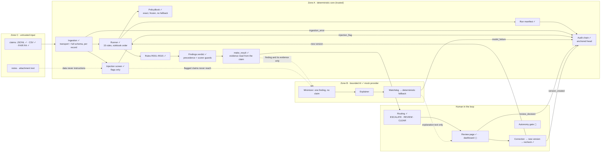

# ClaimGuard AI · architecture and data flow

Phase 1 deliverable. ✓ built and tested · ◻ planned.

## Trust boundaries

**The one-way rule.** Zone B writes explanation text only, to its own file. It cannot write a status, a severity or evidence: those come only from Zone A, and the scored results file is never written by the AI. Any model answer that fails validation, contradicts the finding, cites another rule or evidence that does not exist, times out or errors is replaced by the rule's own explanation and logged as `model_failure`.

**Untrusted text.** No rule reads `notes` or attachment `text`. R010 matches documents on type, patient, service and date only. The minimizer withholds free text and the claim ID from the model, and a claim the injection screen flags never reaches the model at all — it still gets all 15 results.

## Data flow

1. **Ingest.** Each record is checked on its own against the transport contract and the full claim schema (`YYYY-MM-DD` dates only; NaN, Infinity, duplicate keys and non-object records rejected). A bad record becomes an `ingestion_error` with its line, stage and provenance; every other record is still read. Accepted claims carry provenance: adapter, file SHA-256, record SHA-256, line.
2. **Resolve policy.** Exact, case-sensitive; an unknown `policy_id` is `None`, and rules report UNABLE_TO_ASSESS, never FAIL.
3. **Run the rules.** All 15, in rulebook order, each seeing a read-only copy of the results before it. A rule exception becomes UNABLE_TO_ASSESS with human review and is recorded; `--strict` re-raises.
4. **Build results.** `make_result` resolves every evidence pointer against the original claim, so evidence cannot be fabricated. Deterministic results carry `confidence: null`.
5. **Screen.** Every string, decoded and normalized, is scanned for instruction-like text. A flag never changes a result.
6. **Explain** (optional). Each FAIL and UNABLE_TO_ASSESS finding, minimized, goes to the provider; every answer passes the watchdog or falls back.
7. **Route, review, correct.** Any high-severity FAIL/UNABLE → ESCALATE; only medium/low → REVIEW; all PASS/N-A → CLEAR (a clean pre-check, not approval). A correction is a JSON Patch creating a new immutable version; all 15 rules re-run.
8. **Record.** The run manifest; the run's events (start, ingestion errors, injection flags, model failures, finish with the manifest's hash) appended in one batch to the hash chain; the head anchored.

## Tool permissions

| Component | Reads | Writes | Never |
|---|---|---|---|
| Ingestion | input files | ingestion errors | repairs or trims data |
| Rules | one claim, its policy, the service catalogue, earlier results (read-only) | a verdict | read the clock, labels, notes or attachment text |
| Runner | config, policies, accepted claims | the results file | change a rule's status |
| Injection screen | every string of a claim | flags | change a claim or a result |
| AI explainer | one minimized finding and its rule | an explanations file | write a status; see the claim, its ID or its free text |
| Routing | results, review events | routing rows | change a finding |
| Correction | a claim version | a new version | edit the original; change `claim_id`, `schema_version`, `line_id` |
| Audit chain | its log and anchor | appends only | rewrite or delete rows |

## Known limitations

- **Tamper-evident, not immutable.** Whoever controls both the log and its anchor can rewrite both. Single writer only. Production needs append-only (WORM) storage and an anchor held outside the system.
- **The official scorer checks format and statuses, not meaning.** It accepts a wrong severity, invented `method`/`review_status` values, a string where a boolean belongs, or evidence `true` where the claim says `1`. Our own contract tests cover these for our results.
- **Held-out claims outside the documented schema** (NaN, other date formats) are rejected at ingestion, so they produce no results; the scorer would then report missing pairs. Public data contains none.
- **Review decisions carry `input_hash` in the audit log**, but routing does not yet compare it, so a decision on version 1 can still count on version 2 when the status is unchanged.
- **AI:** only the pack's mock provider is wired; the live model awaits the team's model decision. The injection screen is English with some French; an instruction in other words or languages can pass it, which is why model output is validated separately and can never change a result. A provider that hangs keeps running in the background after its timeout.
- **Synthetic, public benchmark only.** Passing is not payer approval.
